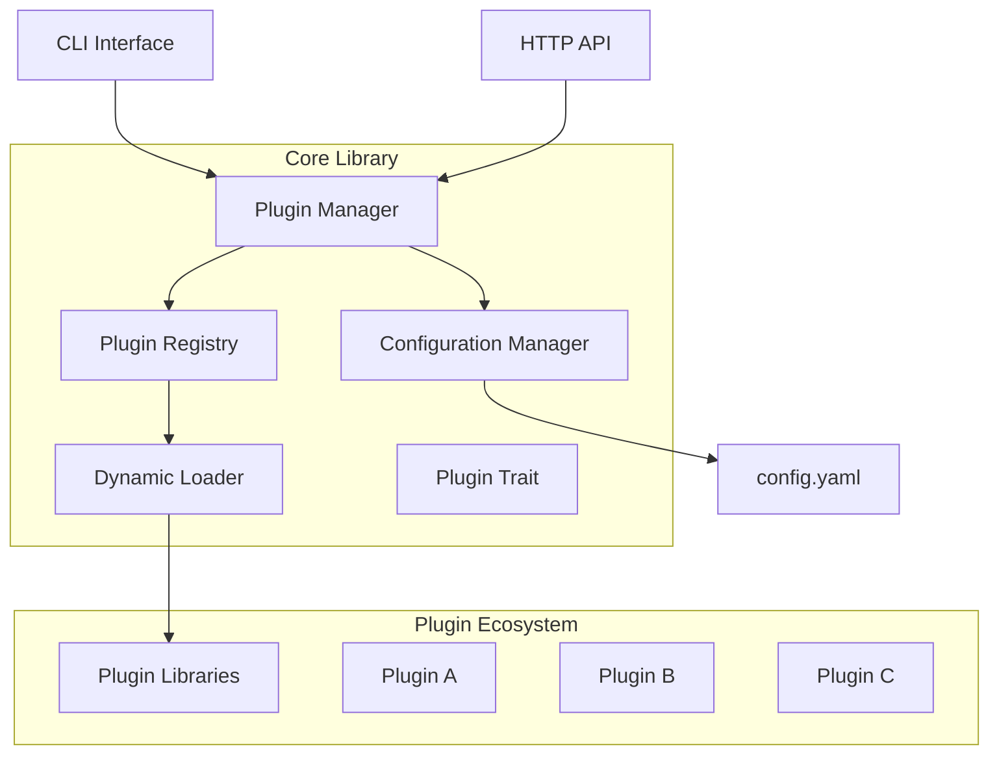

# Design Document

## Overview

The DynPlug Plugin System Core is a dynamic plugin architecture built in Rust that enables runtime loading and execution of external modules. The system follows a modular design with clear separation between the core plugin infrastructure, CLI interface, HTTP API, and individual plugins.

The architecture supports both synchronous and asynchronous plugin execution, comprehensive error handling, and flexible configuration management through YAML files. The system is designed to be fault-tolerant, ensuring that plugin failures don't compromise the overall system stability.

## Architecture

### High-Level Architecture



### Component Architecture

The system is organized into several key components:

1. **Core Library (`core/`)**: Provides the fundamental plugin infrastructure
2. **Main Application (`src/`)**: CLI and HTTP API interfaces
3. **Plugin Ecosystem (`plugins/`)**: Individual plugin implementations
4. **Configuration**: YAML-based configuration management
5. **Build System**: Automated plugin compilation and deployment

## Components and Interfaces

### Core Library Components

#### Plugin Trait (`core/src/plugin.rs`)
Defines the standard interface that all plugins must implement:

```rust
pub trait Plugin: Send + Sync {
    fn name(&self) -> &str;
    fn version(&self) -> &str;
    fn description(&self) -> &str;
    fn execute(&self, input: &str) -> Result<String, Box<dyn std::error::Error>>;
}
```

#### Plugin Registry (`core/src/registry.rs`)
Manages the lifecycle of loaded plugins:

- **Plugin Loading**: Scans directories for shared libraries
- **Symbol Resolution**: Resolves plugin registration functions
- **Plugin Storage**: Maintains registry of loaded plugins
- **Error Handling**: Graceful handling of loading failures

#### Plugin Manager (`core/src/manager.rs`)
High-level plugin management interface:

- **Plugin Operations**: Enable, disable, execute plugins
- **Configuration Integration**: Manages plugin settings
- **Status Tracking**: Maintains plugin state information
- **Batch Operations**: Supports bulk plugin operations

#### Configuration Manager (`core/src/config.rs`)
Handles system and plugin configuration:

- **YAML Parsing**: Loads and saves configuration files
- **Default Values**: Provides sensible defaults
- **Validation**: Ensures configuration integrity
- **Hot Reloading**: Supports runtime configuration updates

#### Service Orchestrator (`core/src/service.rs`)
Coordinates plugin services and lifecycle:

- **Service Management**: Manages long-running plugin services
- **Event Handling**: Processes plugin lifecycle events
- **Resource Management**: Handles plugin resource allocation
- **Graceful Shutdown**: Ensures clean plugin termination

### Main Application Components

#### CLI Interface (`src/main.rs`)
Command-line interface using Clap:

```rust
#[derive(Parser)]
#[command(name = "dyn-plug")]
#[command(about = "A pluggable service system")]
enum Commands {
    List,
    Enable { name: String },
    Disable { name: String },
    Execute { name: String, input: Option<String> },
    Serve { port: Option<u16> },
}
```

#### HTTP API (`src/api.rs`)
REST API using Actix Web:

- **GET /plugins**: List all plugins
- **POST /plugins/{name}/execute**: Execute plugin
- **PUT /plugins/{name}/enable**: Enable plugin
- **PUT /plugins/{name}/disable**: Disable plugin
- **GET /health**: Health check endpoint

### Plugin Development Interface

#### Plugin Registration Macro
Simplifies plugin registration:

```rust
#[macro_export]
macro_rules! register_plugin {
    ($plugin_type:ty) => {
        #[no_mangle]
        pub extern "C" fn register_plugin() -> *mut dyn Plugin {
            Box::into_raw(Box::new(<$plugin_type>::new()))
        }
    };
}
```

#### Plugin Template Structure
Standard plugin crate structure:

```toml
[package]
name = "plugin_example"
version = "0.1.0"
edition = "2021"

[lib]
crate-type = ["cdylib"]

[dependencies]
core = { path = "../../core" }
```

## Data Models

### Plugin Metadata
```rust
#[derive(Debug, Clone, Serialize, Deserialize)]
pub struct PluginInfo {
    pub name: String,
    pub version: String,
    pub description: String,
    pub enabled: bool,
    pub loaded: bool,
    pub path: PathBuf,
}
```

### Configuration Schema
```rust
#[derive(Debug, Serialize, Deserialize)]
pub struct Config {
    pub plugins_dir: PathBuf,
    pub log_level: String,
    pub server: ServerConfig,
    pub plugins: HashMap<String, PluginConfig>,
}

#[derive(Debug, Serialize, Deserialize)]
pub struct ServerConfig {
    pub host: String,
    pub port: u16,
    pub enabled: bool,
}

#[derive(Debug, Serialize, Deserialize)]
pub struct PluginConfig {
    pub enabled: bool,
    pub settings: HashMap<String, serde_json::Value>,
}
```

### API Response Models
```rust
#[derive(Serialize)]
pub struct ApiResponse<T> {
    pub success: bool,
    pub data: Option<T>,
    pub error: Option<String>,
}

#[derive(Serialize)]
pub struct ExecutionResult {
    pub plugin: String,
    pub output: String,
    pub duration_ms: u64,
}
```

## Error Handling

### Error Types
Custom error types using `thiserror`:

```rust
#[derive(Error, Debug)]
pub enum PluginError {
    #[error("Plugin not found: {name}")]
    NotFound { name: String },
    
    #[error("Plugin loading failed: {source}")]
    LoadingFailed { source: libloading::Error },
    
    #[error("Plugin execution failed: {source}")]
    ExecutionFailed { source: Box<dyn std::error::Error> },
    
    #[error("Configuration error: {message}")]
    ConfigError { message: String },
}
```

### Error Handling Strategy
- **Graceful Degradation**: System continues operating when individual plugins fail
- **Comprehensive Logging**: All errors are logged with context
- **User-Friendly Messages**: API and CLI provide clear error messages
- **Recovery Mechanisms**: Automatic retry for transient failures

## Testing Strategy

### Unit Testing
- **Core Components**: Test each core component in isolation
- **Plugin Interface**: Test plugin trait implementations
- **Configuration**: Test configuration loading and validation
- **Error Scenarios**: Test error handling paths

### Integration Testing
- **Plugin Loading**: Test dynamic library loading
- **API Endpoints**: Test HTTP API functionality
- **CLI Commands**: Test command-line interface
- **End-to-End**: Test complete plugin lifecycle

### Plugin Testing
- **Plugin Templates**: Provide testing utilities for plugin developers
- **Mock Framework**: Mock core services for plugin testing
- **Performance Testing**: Benchmark plugin execution performance

### Test Structure
```
tests/
├── unit/
│   ├── plugin_tests.rs
│   ├── registry_tests.rs
│   ├── manager_tests.rs
│   └── config_tests.rs
├── integration/
│   ├── api_tests.rs
│   ├── cli_tests.rs
│   └── plugin_loading_tests.rs
└── fixtures/
    ├── test_plugins/
    └── test_configs/
```

## Security Considerations

### Plugin Isolation
- **Memory Safety**: Rust's memory safety prevents common vulnerabilities
- **Error Boundaries**: Plugin failures are contained
- **Resource Limits**: Plugins operate within defined resource constraints

### API Security
- **Input Validation**: All API inputs are validated
- **Rate Limiting**: Prevent API abuse
- **Authentication**: Optional authentication for sensitive operations

### Configuration Security
- **File Permissions**: Secure configuration file access
- **Sensitive Data**: Secure handling of plugin secrets
- **Validation**: Prevent configuration injection attacks

## Performance Considerations

### Plugin Loading
- **Lazy Loading**: Plugins loaded on first use
- **Caching**: Cache loaded plugins for reuse
- **Parallel Loading**: Load multiple plugins concurrently

### Execution Performance
- **Async Support**: Non-blocking plugin execution
- **Connection Pooling**: Reuse resources across plugin calls
- **Memory Management**: Efficient memory usage patterns

### Monitoring
- **Metrics Collection**: Track plugin performance metrics
- **Health Checks**: Monitor plugin and system health
- **Resource Usage**: Monitor CPU and memory usage

## Deployment Strategy

### Build Process
1. **Core Library**: Build as library crate
2. **Main Application**: Build as binary with core dependency
3. **Plugins**: Build as dynamic libraries (cdylib)
4. **Deployment**: Copy plugins to target directory

### Plugin Distribution
- **Local Development**: Plugins built and deployed locally
- **Plugin Registry**: Future support for plugin distribution
- **Version Management**: Handle plugin version compatibility

### Configuration Management
- **Default Configuration**: Sensible defaults for all settings
- **Environment Variables**: Override configuration via environment
- **Configuration Validation**: Validate configuration on startup